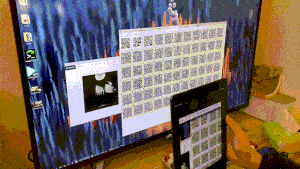

# RaySend · 光传

**用光传文件。** 两台设备、一块屏幕、一颗摄像头，不需要 Wi-Fi、蓝牙或数据线。

[打开网站](https://raysend.myconjure.com) · [Releases](https://github.com/Endy-fei/raysend/releases) · [GitHub](https://github.com/Endy-fei/raysend)

[](https://www.rust-lang.org/)
[](https://webassembly.org/)
[](https://dioxuslabs.com/)
[](https://raysend.myconjure.com)



RaySend（光传）是一个跑在浏览器里的离线文件传输工具。发送端把文件压成动画二维码播放，接收端用摄像头扫码还原。全程没有账号、没有后台、没有上传：压缩、编码、扫描、校验、解压都在本机完成。

适合这些场景：

- 两台电脑互不联网，仍要把一份文档、密钥或配置送过去
- 隔离网、会议室、机房等不能插 U 盘、也不能连局域网的环境
- 手机和电脑之间临时传一个小文件，不想开热点、不想装 IM

---

## 目录

- [特点](#特点)
- [快速开始](#快速开始)
- [使用说明](#使用说明)
- [工作原理](#工作原理)
- [传输协议](#传输协议)
- [性能](#性能)
- [隐私与安全](#隐私与安全)
- [浏览器支持](#浏览器支持)
- [本地开发](#本地开发)
- [测试](#测试)
- [项目结构](#项目结构)
- [自行部署](#自行部署)
- [Windows 安装包](#windows-安装包)
- [常见问题](#常见问题)
- [贡献](#贡献)
- [技术栈](#技术栈)

---

## 特点

| | |
| --- | --- |
| **空气墙可用** | 通道是可见光，不依赖局域网、蓝牙、USB 或云存储 |
| **喷泉码** | RaptorQ 编码。漏扫、花屏、扫到重复帧都没关系，凑够符号即可还原 |
| **当场画码** | Canvas 即时生成二维码，不会预先堆几百张图把内存打满 |
| **1×1 / 2×2** | 手机默认单码；屏幕宽度 ≥ 720px 时默认 2×2，吞吐大约 4 倍 |
| **浏览器内压缩** | Brotli（质量 5）。文本、源码、文档体积通常会明显下降 |
| **密度档** | 稳 v20 / 默认 v27 / 快 v40，ECC L；扫不动时先降密度再降帧率 |
| **完整性校验** | 原始字节 SHA-256，对不上不会交付文件 |
| **中英界面** | 跟随浏览器语言，可随时切换，偏好保存在本机 |
| **深浅色** | 跟随系统主题，可手动切换 |
| **纯静态站点** | 无服务器。GitHub Pages 托管，也可以自己放到任意静态目录 |

单文件上限 **64 MB**。空文件不能发送。当前线格式为 **R2**，与旧版 `QT` 协议不互通。

---

## 快速开始

1. 发送端打开 [raysend.myconjure.com](https://raysend.myconjure.com)，选择或拖入文件。
2. 等待压缩完成，屏幕开始播放二维码。
3. 接收端打开同一网站，允许摄像头，对准发送端屏幕。
4. 进度走满后自动校验、解压并下载。

摄像头需要 **HTTPS**（或 `localhost`）。公网站点已经是 HTTPS；本地开发时 `dx serve` 提供的地址也可以用。

想确认文件没有离开本机：选文件前关掉 Wi-Fi / 蜂窝数据即可。站点本身不发起上传请求。

---

## 使用说明

### 发送

1. 打开 **发送** 页，点击虚线区域选文件，或把文件拖进去。
2. 浏览器读取文件 → Brotli 压缩 → 生成喷泉码。状态栏会显示当前步骤。
3. 进入播放页后可以：
   - **播放 / 暂停**
   - **调速度**（默认约 12 fps）
   - **单码 ↔ 2×2 宫格**
   - **返回** 重新选文件

2×2 适合笔记本或显示器：四个码同时播，接收端扫到任意足够帧即可，不必四个码都盯死。手机屏幕小，建议保持单码，把码尽量铺满、亮度拉高。

### 接收

1. 打开 **接收** 页，点 **开启相机**。
2. 对准发送端二维码。状态会从「对准」变为扫描进度。
3. 点按预览画面可在前后摄像头之间切换。
4. 完成后会响一声提示音，并触发下载。可用 **再次下载** 再保存一次。

接收端不必从第一帧开始扫，也不必按顺序扫。喷泉码的设计就是：任意足够多的互异符号都能还原。

### 实用建议

- 发送端全屏、提高屏幕亮度、关掉屏保。
- 接收端拿稳，避免强反光和过曝。
- 已经压缩过的文件（zip、jpg、mp4、pdf 等）几乎压不动，耗时接近上限估算。
- 纯文本、JSON、源码、CSV 往往压得很多，实际耗时会短不少。
- 传大文件时尽量用 2×2 + 较近距离，不要靠提高 fps 硬扛：扫不稳会浪费帧。

---

## 工作原理


每帧都是有用符号：28 字节头（魔数 `R2`、版本、session、序号、OTI、容器长度、校验）后面跟 RaptorQ 包。文件名和哈希在喷泉还原后的容器里。旧版 `QT` 会被识别并提示升级。

发送端先按块发源符号，再发修包。接收端用 `rqrr` 快路径找码（未命中再回退 `quircs`），锁定后只扫运动预测区域。网页把解码丢进最多 4 个专用 Worker（失败则回退主线程）；桌面采集与解码分线程，多码裁剪并行。

默认二维码为 **QR Version 40、ECC L**（约 2953 字节/帧）；稳档 v20、中档 v27。固定 mask，跳过 8 次评估。默认 **60 fps**，扫不动时再降。

---

## 传输协议

帧均为二进制，便于塞进二维码的 byte 模式。与旧 `QT` **不兼容**。

| 偏移 | 内容 |
| --- | --- |
| 0–1 | 魔数 `R2` |
| 2 | 版本 `1` |
| 3 | flags（低 4 位 must-understand） |
| 4–5 | session id |
| 6–9 | 序号 `u32` |
| 10–21 | RaptorQ OTI |
| 22–25 | 容器总长 `u32` |
| 26–27 | 头校验 |
| 28… | RaptorQ 编码包（含 4 字节包头） |

容器（喷泉还原之后）含原始长度、SHA-256、文件名、可选 MIME，以及仅在变小时采用的 Brotli 载荷。

无法识别的字节会被忽略。扫到旧 `QT` 时界面提示两端升级。

---

## 性能

吞吐取决于屏幕大小、相机素质、距离、密度档和宫格，而不是网速。

| 模式 | 经验吞吐 | 说明 |
| --- | --- | --- |
| 单码默认 v40 @ 60 fps | 近距大屏 | 扫不动先降到 v27 / 24 |
| 宽屏 2×2 + v40 @ 60 | 数百 KB/s | 与高密度发送对齐时的目标量级 |
| 纪录档 418 KB/s | 不作为验收 | 超宽屏 + 旗舰机，捕获跟得上才有 |

播放器按 `符号大小 × fps × 宫格数 × 0.7` 估算剩余时间。界面上的进度来自「互异符号数 / 预计所需符号数」。传完后接收页会给出回执（`capture_fps`、捕获率、快路径命中），用来核对真实吞吐。扫不动时先降密度，再降 fps。

RaptorQ 仍按块拆分，避免 WASM 建编码器卡死。

---

## 隐私与安全

RaySend 的目标是：**文件不要经过任何你看不见的机器。**

- 没有登录、没有遥测、没有后端 API。
- 站点是静态 HTML + WASM，由 GitHub Pages 提供。
- 传输介质是屏幕上的可见光。旁边的人如果能看到屏幕，理论上也能扫——这和把文件举到别人眼前是同一类风险。
- 哈希用于发现传输出错，不是保密手段。需要保密时，请先在本机加密再发送。
- 语言偏好存在 `localStorage` 键 `raysend.lang`，不会上传。
- 摄像头仅在接收页、你点击开启后使用；离开接收或点停止会关掉轨道。

这不是端到端加密通讯工具，也不是网盘。它解决的是「两台机器之间没有电的连接」这一个问题。

---

## 浏览器支持

需要：

- WebAssembly
- Camera / `getUserMedia`（接收）
- Canvas 2D
- Blob 下载

建议使用较新的 **Chrome、Edge、Safari、Firefox**。iOS Safari 可以接收，但必须在 HTTPS 下授权相机。部分浏览器的隐私模式会限制 `localStorage`，语言切换可能无法记住，不影响传输。

桌面发送 + 手机接收是最常见组合。两台电脑也可以：一台全屏播码，另一台用摄像头或外接摄像头对准。

---

## 本地开发

### 环境

- Rust（stable）
- 目标三元组 [`wasm32-unknown-unknown`](https://doc.rust-lang.org/rustc/platform-support/wasm32-unknown-unknown.html)

  ```bash
  rustup target add wasm32-unknown-unknown
  ```

- [Dioxus CLI 0.7.x](https://dioxuslabs.com/learn/0.7/getting_started)

  ```bash
  cargo install dioxus-cli --version 0.7.10 --locked
  ```

### 运行

```bash
git clone https://github.com/Endy-fei/raysend.git
cd raysend
cd crates/raysend-web
dx serve --platform web
```

在网页 crate 目录里跑 `dx serve`，终端会打印本地地址。改 Rust / CSS 后 CLI 会重新编译 WASM。

`crates/raysend-web/build.rs` 会在首次构建时把 GitHub Mark 图标下载到 `crates/raysend-web/public/assets/images/`（该目录已加入 `.gitignore`）。离线构建前请确保该文件已存在，或允许构建脚本访问网络。同一脚本还会把专用解码 WASM 编到 `public/qr-decode/`，给接收页 Worker 用；需要已安装 `wasm32-unknown-unknown`。跳过可设环境变量 `SKIP_DECODE_WASM=1`（Worker 会退回主线程解码）。

### 生产构建

```bash
cd crates/raysend-web
dx bundle --release --platform web --out-dir ../../dist
```

静态资源写到仓库根的 `dist/public/`。可以丢进任何静态服务器、对象存储或 GitHub Pages。

---

## 测试

协议、压缩和喷泉码还原不依赖浏览器，可直接：

```bash
cargo test -p raysend-core
```

覆盖内容包括：

- 元数据 / 数据帧编解码，以及垃圾输入拒绝
- Brotli 往返
- 丢包条件下 RaptorQ 仍能还原
- 元数据后到时，暂存的数据帧仍能被消化
- QR Version 20 + ECC M 放得下协议载荷
- 扫描管线从喷泉帧重建文件

WASM UI 需要在浏览器里手测：选文件、播码、授权相机、前后摄像头、中英切换、深浅色。

Windows / Linux / macOS 原生（iced，无浏览器套壳）：

```bash
cargo run -p raysend-desktop --release
```

- **Windows**：需要 **MSVC 生成工具**（Visual Studio Build Tools，勾选「使用 C++ 的桌面开发」）和 Windows SDK。
- **Linux**：需要系统 GUI 依赖（Vulkan / OpenGL）以及摄像头的 V4L2 开发库（常见包名 `libv4l-dev`）。
- **macOS**：用 Xcode Command Line Tools；第一次开相机时系统会要权限。

苹果桌面是 **macOS**。iOS 不是桌面系统，手机/平板仍走 `raysend-ffi`。缺少上述环境时请自行安装，不要用 rustup 以外的方式代装。

---

## 项目结构

```text
raysend/
├── Cargo.toml               # virtual workspace + wasm-dev profile
├── crates/
│   ├── raysend-core/        # 协议 / 喷泉码 / 压缩 / QR / 扫码（无浏览器依赖）
│   ├── raysend-decode/      # 网页 Worker 用的小体积扫码 WASM（无 Dioxus / 喷泉）
│   ├── raysend-ffi/         # C ABI：后续 Android / iOS / 鸿蒙接入
│   ├── raysend-desktop/     # 原生桌面（iced：Windows / Linux / macOS，非 WebView）
│   └── raysend-web/         # 网页版（Dioxus + WASM）
│       ├── src/
│       ├── public/          # qr-decode-worker.js；qr-decode/ 由 build.rs 生成
│       ├── index.html
│       ├── Dioxus.toml
│       └── build.rs
└── .github/workflows/
```

---

## 自行部署

推送到 `master` 后，GitHub Actions 会执行 `dx bundle`，并把 `dist/public` 发布到 `gh-pages`。当前绑定域名为 [raysend.myconjure.com](https://raysend.myconjure.com)。

若使用自己的域名：

1. 把 `crates/raysend-web/public/CNAME` 和 `.github/workflows/pages.yml` 里的 `cname` 改成你的域名。
2. DNS 增加 **CNAME**，指向 `endy-fei.github.io`（或你的 `用户名.github.io`）。
3. 在仓库 Settings → Pages 中确认源分支为 `gh-pages`。

也可以跳过 GitHub Pages，把 `dx bundle` 的产物放到 Nginx、Caddy、Cloudflare Pages、对象存储静态网站等任意位置。记住：**接收端必须是 HTTPS**，否则浏览器不会开放摄像头。

---

## Windows 安装包

原生桌面请用 `cargo run -p raysend-desktop --release`。下面的 MSI 是另一条路径：用 Pake 把网页打成本地窗口。

1. 打开 GitHub Actions 里的 **release** 工作流。
2. 手动 `Run workflow`。
3. 完成后在 [Releases](https://github.com/Endy-fei/raysend/releases) 下载 `RaySend.msi`。

该工作流使用 [Pake](https://github.com/tw93/Pake) 包装 `dx bundle` 的产物，带本地文件拖放。它不会上传你的文件。

---

## 常见问题

**为什么比网盘慢这么多？**  
可见光二维码的带宽大约是十几 KB/s 量级，这是媒介决定的。RaySend 换的是「不需要网络和线」，不是速度。

**扫了很久进度不动？**  
先确认发送端在播放、码没有被窗口挡住。调低 fps、改回单码、拉近距离、提高亮度。接收端进度看的是互异符号，重复扫同一帧不会涨。

**相机打不开？**  
检查是否 HTTPS、是否拒绝过权限、是否被其他应用占用。iOS 上必须用 Safari 或支持 `getUserMedia` 的浏览器，并在系统设置里允许相机。

**文件下下来是坏的？**  
正常路径会先校验哈希再解压。如果浏览器下载被杀毒软件改写，请对比文件大小；也可以点再次下载。

**能传文件夹吗？**  
目前是单文件。请先自行打包成 zip 再发。注意 zip 已经压缩，时间会接近「按体积估算」的上限。

**最大为什么是 64 MB？**  
二维码通道仍然慢，再大就不实用；密度档提高后 20 MB 不再是硬瓶颈。64 MB 是体验和内存之间的折中。

**和旧版网站互扫失败？**  
线格式已改为 `R2`，与旧 `QT` 不互通。两端都要更新到同一版本。

**语言切换没记住？**  
部分隐私模式禁用 `localStorage`。刷新后会按浏览器语言重新检测。

---

## 贡献

Issue 和 Pull Request 都欢迎。改协议或编码参数时，请补 `cargo test`，并说明是否还与现有已发布站点兼容（当前协议魔数为 `R2`，与旧 `QT` 不互通）。

建议的改动方向：

- 更大屏的宫格或自适应布局
- 更稳的摄像头对焦 / 取景引导
- 更多语言
- 在不牺牲空气墙前提的前提下缩短大文件时间

---

## 技术栈

| 部分 | 选用 |
| --- | --- |
| 核心 | `raysend-core`（协议 / RaptorQ / Brotli / QR / 扫码） |
| 网页 | Rust → WASM，[Dioxus](https://dioxuslabs.com/) 0.7 |
| Windows / Linux / macOS | iced，无 WebView，界面与网页对齐 |
| 后续 Android / iOS / 鸿蒙 | `raysend-ffi` C ABI（`include/raysend.h`） |
| 喷泉码 | [raptorq](https://github.com/cberner/raptorq) 2.0（RFC 6330） |
| 压缩 | [brotli](https://github.com/dropbox/rust-brotli) |
| 二维码生成 | [qrcode](https://crates.io/crates/qrcode) |
| 二维码识别 | [rqrr](https://crates.io/crates/rqrr) + [quircs](https://crates.io/crates/quircs) |
| 哈希 | SHA-256（完整性，非保密用途） |

---

两台互不联网的设备，一块屏幕，一颗摄像头。文件从这边走到那边。
